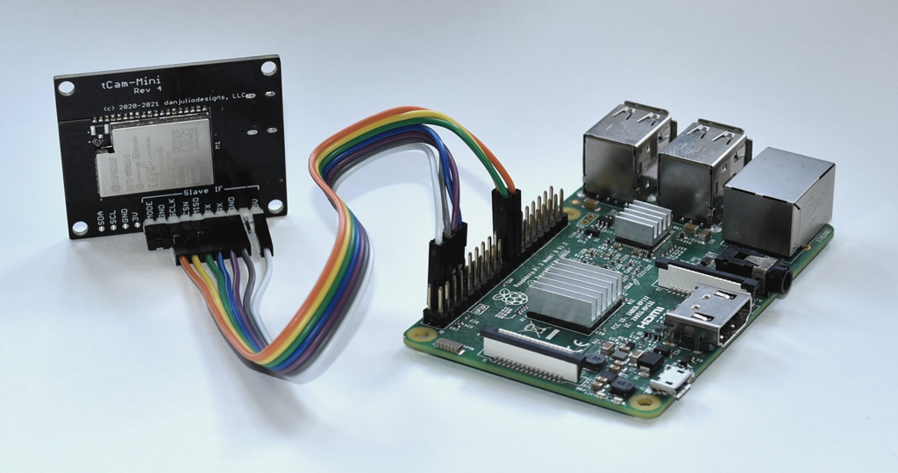

## tCam-Mini Python Driver
Todd LaWall (bitreaper) wrote a python 3 driver to allow access to tCam and tCam-Mini from python programs.  The driver supports accessing tCam and tCam-Mini via the network socket interface and also supports accessing tCam-Mini via the hardware Slave Interface on a Raspberry Pi.

### tcam.py
The ```tcam.py``` file contains an object ```TCam``` used to connect to and communicate with a camera.  It manages the socket connection and provides an API for sending commands to the camera and for receiving responses back from the camera.  It uses three queues to handle the asynchronous nature of the interface.  A command queue is used for outgoing commands to the camera.  Responses from the camera are pushed into two incoming queues.  Image responses are stored in a special image queue.  All other responses are stored in a response queue.  The API hides queue operation.  API operations are single threaded and do not return until a response is returned or a timeout expires.  All response packets are presented as a python dictionary built from the json response string.

#### Network Usage
Include the TCam object from ```tcam.py``` file in your program.

	from tcam import TCam

Create a reference.

	cam = TCam()

Open a connection to the camera.

	cam.connect(<ip_address>)

where ```<ip_address>``` is the camera's IP address as a string.  The connect method returns a response indicating of the connection was successful or not.

	{"status": "timeout"}
	{"status": "connected"}

#### Hardware Interface Usage
See below for a diagram showing how to connect the tCam-Mini hardware Slave Interface to the Raspberry Pi default serial and SPI ports.

Use the Raspberry Pi Configuration tool to enable the serial interface (make sure the console on that port is disabled) and the SPI port.  Increase the maximum SPI transfer the Pi can perform by editing the ```/boot/cmdline.txt``` file and add the following string to the end of the line in that file.  Reboot the Pi after making this change.

	spidev.bufsiz=65536
	
Include the TCam object from ```tcam.py``` file in your program.

	from tcam import TCam

Create a reference.

	cam = TCam(is_hw=True)

Open a connection to the camera using the default serial (```/dev/serial0```) and SPI master (```/dev/spidev0.0```).

	cam.connect()

To use alternate Pi hardware, specify the device files in the connect method.

	cam.connect(spiFile='/dev/spidev0.1', serialFile='/dev/serial1')
	
#### Common Usage

Then call various access methods to send information to or get information from the camera.

	img = cam.get_image()

Finally, shut down the driver before finishing your program to close the socket connection and terminate an internal manager thread.

	cam.shutdown()

### Timeouts
All API calls take an optional timeout value which [full description TBD].

### Demos
The ```examples``` directory contains several example python programs using the TCam driver.

The example programs take command line arguments.  Look at the source code for example-specific arguments but all examples allow specifying the camera IP address as shown.  By default the TCam driver attempts to connect to the default tCam-as-AP address of ```192.168.4.1```.

	disp_image.py -i 10.0.1.71

Some of the demo programs like ```disp_file.py``` and ```dump_image.py``` must be run in the same directory as the ```palettes``` directory.

The ```streamtest_hw.py``` program demonstrates how to use the driver with the hardware interface.

### tCam-Mini Hardware Interface Connections



The tCam-Mini hardware Slave Interface is enabled on power-up when the tCam-Mini detects a jumper from the MODE pin to GND.  Seven wires interface the Slave Interface to the Pi and provide power as shown below.  Be sure to make all the connections before applying power to the Pi.

